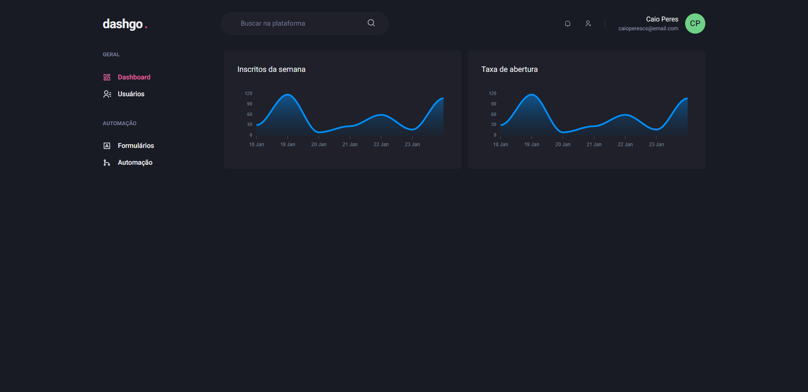

<h1 align="center">
  dashgo<span style="color: #D53F8C">.</span>
</h1>

<h3 align="center">
  NextJS Application for dashgo
</h3>

<p align="center">
  

  <a href="https://www.linkedin.com/in/caioperess/" target="_blank" rel="noopener noreferrer">
    
  </a>

  

  <a href="https://github.com/caioperess/ignite-dashgo/commits/master">
    
  </a>

  <a href="https://github.com/caioperess/ignite-dashgo/issues">
    
  </a>
</p>

<p align="center">
  <a href="#%EF%B8%8F-about-the-project">About the project</a>&nbsp;&nbsp;&nbsp;|&nbsp;&nbsp;&nbsp;
  <a href="#-technologies">Technologies</a>&nbsp;&nbsp;&nbsp;|&nbsp;&nbsp;&nbsp;
  <a href="#-getting-started">Getting started</a>&nbsp;&nbsp;&nbsp;|&nbsp;&nbsp;&nbsp;
  <a href="#-how-to-contribute">How to contribute</a>
</p>

</br>

<p align="center">
  
</p>

## 📈 About the project

dashgo. is a dashboard made with Chakra UI

## 🚀 Technologies

Technologies that I used to develop this application

- [ReactJS](https://reactjs.org/)
- [TypeScript](https://www.typescriptlang.org/)
- [NextJS](https://nextjs.org)
- [Chakra UI](https://chakra-ui.com/)
- [React Hook Form](https://react-hook-form.com/)
- [Apexcharts](https://apexcharts.com/)

## 💻 Getting started

### Requirements

**Clone the project and access the folder**

```bash
$ git clone https://github.com/caioperess/ignite-dashgo.git && cd ignite-dashgo
```

**Follow the steps below**

```bash
# Install the dependencies
$ yarn

# To start the project in dev mode, run this command
$ yarn dev

# To build the project, run this command
$ yarn build
```

## 🤔 How to contribute

**Make a fork of this repository**

```bash
# Fork using GitHub official command line
# If you don't have the GitHub CLI, use the web site to do that.

$ gh repo fork caioperess/ignite-dashgo
```

**Follow the steps below**

```bash
# Clone your fork
$ git clone your-fork-url && cd ignite-dashgo

# Create a branch with your feature
$ git checkout -b my-feature

# Make the commit with your changes
$ git commit -m 'feat: My new feature'

# Send the code to your remote branch
$ git push origin my-feature
```

After your pull request is merged, you can delete your branch

---

Made with 💜 by Caio Peres 👋 [See my linkedin](https://www.linkedin.com/in/caioperess/)
